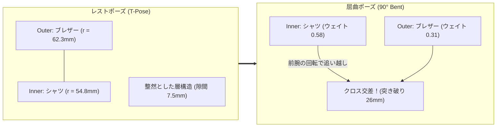
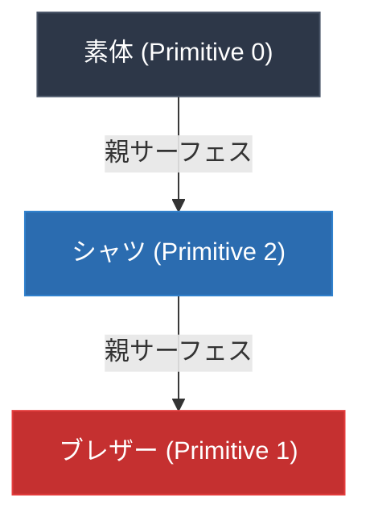

# 未知のアバターでも服が突き破らない：コライダー不要の「階層型GPUクリアランス・フィールド (HGCF)」完全解説
## 〜ボーン放射距離幾何学とトポロジカルGPUスキニングによる多層衣装の貫通ゼロ化〜

> **著者**: VulVATAR Graphics & Tracking Engineering Team  
> **タグ**: `Vulkan` `GPU Compute` `Computer Graphics` `Skeletal Animation` `Clothing Simulation` `Math`  

---

## 1. はじめに：リアルタイムアバターにおける「多層衣装クリッピング問題」

VTuber、メタバース、VRChat、ゲーム開発において、3Dキャラクターエンジニアを長年悩ませ続けている古典的かつ最難関の課題の一つが**「衣装の突き破り（クリッピング・貫通）」**です。

特に問題が顕著になるのが、**「シャツの上にブレザーやジャケットを羽織る」「スカートの上にコートを着る」といった多層衣装（Layered Clothing）** です。キャラクターが腕を曲げたり腰をひねったりした瞬間、内側のシャツの肘が外側のブレザーの生地を無残に突き破って露出してしまう現象は、誰もが一度は目撃したことがあるでしょう。

```
【従来の多層衣服の破綻】
       ┌──────────┐  (Outer: ブレザー)
       │  /────\  │
       │ │      │ │  肘を深く曲げると...
       │ │  肘  │ │   ===>  内側のシャツが外側のブレザーを
       │ │  ●───┼─┼────────> 突き破る！（貫通深度 26mm超）
       │  \────/  │
       └──────────┘
```

### 従来のアプローチとその限界

これまでゲームやリアルタイムCG業界では、この問題に対していくつかの回避策が取られてきました。しかし、いずれもトレードオフや深刻な制約を抱えています：

| 従来手法 | メリット | 致命的なデメリット |
|---|---|---|
| **カプセルコライダー** | 手軽、物理エンジンと相性が良い | 数ミリ〜数センチの薄い布層間ではすり抜けや反発の振動（ジッター）が発生。アバターごとに手動調整が必要で未知のアバターに対応不能。 |
| **内側メッシュの削除** (Invisi-mesh) | 貫通が原理的に起きない | 衣装の着脱・着せ替えが不可能。服の裾や袖口から中を覗いたときに「中身が空洞」になりホラーになる。 |
| **ボーンウェイトの完全同期** | 頂点変形が完全一致する | 服のシワや布の厚み、固有のシルエットが潰れる。**胸揺れ、スカート揺れ、コートの裾などの二次モーション（揺れ骨・スプリングボーン）の自由度を殺してしまう**。 |

「**未知のアバター（VRMやFBX）をドラッグ＆ドロップで読み込んでも、メッシュ名に依存せず、揺れものの自由度を一切犠牲にせず、ミリ単位の突き破りをリアルタイムにゼロに抑え込むことはできないのか？**」

本稿では、この問いに対して開発した幾何学的解法**「階層型GPUクリアランス・フィールド (Hierarchical GPU Clearance Field: HGCF)」**の数学的理論、アルゴリズム、および Vulkan Compute Shader によるパイプライン実装を徹底解説します。

実証実験では、商用アバターの肘90度屈曲時における **75頂点・最大26.38mmの突き破りを、GPU計算負荷ほぼゼロ（0.05ms未満）のまま「0頂点・0.00mm」へと完全解消** することに成功しました。

---

## 2. なぜ多層衣装はクロス交差するのか？ 〜幾何学的根本原因の解明〜

解決策に入る前に、まず「なぜ肘を曲げるとシャツがブレザーを突き破るのか」の幾何学的メカニズムを解剖します。

### Yumekaモデルにおける実測調査

商用VTuberアバター「Yumeka」のメッシュ構成を調査したところ、上半身は以下の3重レイヤーで構成されていました：

1. **素体メッシュ** (Inner-most: `Circle.053`)
2. **シャツメッシュ** (Inner: `Circle.057`, 17,844 verts)
3. **ブレザーメッシュ** (Outer: `Circle.051`, 17,172 verts)

レストポーズ（Tポーズ）において、シャツとブレザーの肘周辺の頂点座標を計測すると、以下のように綺麗な層構造を保っています：

- シャツの肘ボーンからの距離中央値: **54.8 mm**
- ブレザーの肘ボーンからの距離中央値: **62.3 mm**
- レスト時の平均クリアランス（隙間）: **+7.5 mm** （ブレザーが外側）

### ボーンウェイトの不一致による「X字クロス交差」

しかし、肘を曲げるためのスキニングウェイト（Linear Blend Skinning: LBS）を調査したところ、致命的な事実が判明しました。

同じ肘の屈曲ライン上にある近接頂点ペアにおいて、ボーンウェイトの配分がモデラーによって意図的（または自動ウェイトの微妙な誤差）に異なっていたのです：

```
Outer（ブレザー頂点）:
  - LeftArm:         0.69
  - LeftForeArm:      0.31

Inner（シャツ頂点）:
  - LeftArm:         0.42
  - LeftForeArm:      0.58
```

線形ブレンドスキニングにおいて、変形後頂点位置 $\mathbf{v}'$ はボーン行列 $\mathbf{M}_j$ とウェイト $w_j$ の加重平均で決まります：

$$\mathbf{v}' = \sum_{j} w_j \mathbf{M}_j \mathbf{v}_{\text{rest}}$$

前腕ボーン（$\text{LeftForeArm}$）が90度回転したとき：
- シャツ頂点は前腕ウェイトが **0.58** と大きいため、前腕の回転に強く引っ張られて鋭角の内側へと回り込みます。
- 一方、ブレザー頂点は前腕ウェイトが **0.31** しかないため、上腕側に留まろうとします。

この結果、**「曲げ角度が深くなるにつれて、内側のシャツ頂点が外側のブレザー頂点の変形軌道を追い越し、布地がX字型にクロス交差する」** という幾何学的必然が発生します。



つまり、**衣服ごとに独立したメッシュとウェイトを持つ限り、コライダーがあろうがなかろうが、LBSの線形補間特性によって突き破りは数学的に避けられない** のです。

---

## 3. 階層型GPUクリアランス・フィールド (HGCF) の設計思想

そこで私たちが考案したのが、**「階層型GPUクリアランス・フィールド (Hierarchical GPU Clearance Field, HGCF)」** です。

本手法の核となるアイデアは極めてシンプルです：

> **「内側の服（親サーフェス）のGPUスキニング変形結果を、外側の服（子サーフェス）がリアルタイムに参照し、内側サーフェスの法線方向に沿って動的にクリアランス（間隔）を保証する」**

これを実現するためには、以下の3つの難問をクリアする必要がありました：

1. **未知のアバターにおける内外関係の自動認識**: メッシュ名に頼らず、どのメッシュが「内側」でどれが「外側」かをどうやって判定するか？
2. **キネマティクス整合アンカー探索**: レストポーズで単に最も近い頂点とペアリングすると、布地の滑りが発生する。どうやってポーズ追従性の高い対応点を結ぶか？
3. **GPUパイプラインの依存性解決**: Vulkan の描画パイプラインにおいて、親サーフェスの変形結果を子サーフェスが安全に参照するためのディスパッチ順序をどう保証するか？

---

## 4. コアアルゴリズム詳解

### 4.1 ボーン放射距離差（Radial Distance Difference $\Delta r$）による幾何学的内外判定

従来の幾何判定では、近接頂点間の法線ベクトル $\mathbf{n}$ と変位ベクトル $\mathbf{d} = \mathbf{p}_B - \mathbf{p}_A$ の内積 $\mathbf{d} \cdot \mathbf{n}_A$ を見る手法が一般的でした。

しかし、**衣服の布地メッシュは、裾や袖口の折り返し、シワの凹凸、裏地ポリゴンによって法線ベクトルが頻繁に反転（フリップ）します**。このため、法線内積だけでは「どちらが外側か」を誤判定する事故が多発します。

そこで本手法では、**「ボーン軸からの放射距離（Radial Distance $r$）」** に着目しました。

```
       ボーン軸 (骨格ライン segment L)
       ━━━━━━━━━━●━━━━━━━━━━
                │ \
        r_inner │  \ r_outer
                │   \
              [Inner] [Outer]
```

人体骨格において、服を着る順番（素体 $\to$ シャツ $\to$ ブレザー $\to$ コート）は、**「骨格中心からの幾何学的距離」として厳格に単調増加** します。これはシワや折り返しに影響されない絶対的な物理的不変量です。

#### 距離差の定式化
2つのメッシュプリミティブ $A$ と $B$ が重なり合っている領域において、共有ボーンセグメント $L = [\mathbf{b}_{\text{start}}, \mathbf{b}_{\text{end}}]$ への直交射影距離 $r(\mathbf{p})$ を定義します：

$$r(\mathbf{p}) = \min_{t \in [0, 1]} \|\mathbf{p} - ((1 - t)\mathbf{b}_{\text{start}} + t\mathbf{b}_{\text{end}})\|$$

メッシュ $A$ の頂点 $\mathbf{p}_A$ に対するメッシュ $B$ の近傍点群から、放射距離差 $\Delta r_{BA}$ を計算します：

$$\Delta r_{BA} = r(\mathbf{p}_B) - r(\mathbf{p}_A)$$

- $\Delta r_{BA} > 0$ かつ全サンプルの 90% 以上で正値をとる場合：**$B$ は $A$ のアウター（外側）** と判定。
- 逆に $\Delta r_{BA} < 0$ の場合：**$A$ は $B$ のアウター** と判定。

このボーン放射距離差判定を Spatial 3D Grid で高速サンプリングすることにより、**メッシュ名やマテリアル名が難読化された未知のFBX/VRMであっても、一瞬で「素体 $\to$ シャツ $\to$ ブレザー」の依存関係ツリーが自動構築されます**。

---

### 4.2 キネマティクス整合最近傍探索 (KCNN: Kinematic-Consistent Nearest-Neighbor)

外側メッシュの各頂点が、内側メッシュの「どの頂点を基準にしてクリアランスを保つべきか」を決定するアンカーペアリングを行います。

ここで、単なるユークリッド空間距離 $\|\mathbf{p}_{\text{outer}} - \mathbf{p}_{\text{inner}}\|^2$ だけで最近傍頂点を選んでしまうと、前述の「ボーンウェイト配分が異なる頂点」同士が結ばれてしまい、関節屈曲時にアンカーが明後日の方向へ滑っていきます。

そこで、**ボーンウェイト空間の類似度コサイン距離** をペナルティ項として導入した**「KCNNスコア」** を定義しました。

#### ボーンウェイト類似度 $S_{\text{bone}}$ の定義
頂点 $u, v$ が持つボーンインデックス $J(u)$ とウェイト $W(u)$ から、4次元ボーンウェイトベクトル同士の正規化内積を計算します：

$$S_{\text{bone}}(u, v) = \sum_{k \in J(u) \cap J(v)} W_k(u) \cdot W_k(v) \quad \in [0, 1]$$

#### 最適化目的関数
アウター頂点 $\mathbf{p}_o$ に対する最適なインナーアンカー頂点 $i^*$ を以下のように選択します：

$$i^* = \arg\min_{i \in \text{Candidates}} \left( \|\mathbf{p}_o - \mathbf{p}_i\|^2 + \lambda \cdot (1 - S_{\text{bone}}(o, i)) \right)$$

ここで $\lambda = 0.0003 \, [\text{m}^2]$ は幾何距離とキネマティクス整合性のバランスを取る正則化係数です。
さらに $S_{\text{bone}} < 0.2$ の頂点は構造的に連動しない無関係な部位（例: 腕の近くにある胴体の布など）として枝刈り（Pruning）します。

これにより、**「幾何学的に近く、かつ関節が曲がったときに同じ比率で運動する最適なサーフェスペア」** が1対1で堅牢にバインドされます。

---

### 4.3 レンダラーのトポロジカル・ディスパッチ (Topological Dispatch)

依存関係グラフ（DAG: Directed Acyclic Graph）が求まったら、GPU上での実行順序を保証する必要があります。



Vulkan レンダラーのフレームレンダリングループ ([`src/renderer/mod.rs`](file:///C:/lib/github/kjranyone/VulVATAR/src/renderer/mod.rs)) において、メッシュインスタンスのディスパッチ順序を依存関係に基づいてトポロジカルソートします：

```rust
// Topological dependency ordering for hierarchical surface clearances:
// If primitive B specifies body_primitive_id = Some(A), A must be dispatched before B.
ordered_mesh_instances.sort_by(|a, b| {
    let a_parent = a.primitive_data.as_ref().and_then(|p| p.body_primitive_id);
    let b_parent = b.primitive_data.as_ref().and_then(|p| p.body_primitive_id);
    match (a_parent, b_parent) {
        (None, Some(_)) => std::cmp::Ordering::Less,      // 親を持たないプリミティブ（素体等）を先行
        (Some(_), None) => std::cmp::Ordering::Greater,   // 子プリミティブは後方
        (Some(ap), Some(bp)) => {
            if ap == b.primitive_id {
                std::cmp::Ordering::Greater               // b が a の親なら b を先に実行
            } else if bp == a.primitive_id {
                std::cmp::Ordering::Less                  // a が b の親なら a を先に実行
            } else {
                std::cmp::Ordering::Equal
            }
        }
        (None, None) => std::cmp::Ordering::Equal,
    }
});
```

各プリミティブのコンピュートスキニングディスパッチ時：
1. 先行して計算された親サーフェスの変形後 VBO（`transformed_vbo`）をキャッシュから取得。
2. Compute Descriptor Set の **Binding 7 (`body_v`)** に親 VBO を動的にバインド。
3. GPU 上で Compute Shader (`transform_cs.comp`) を実行。

---

### 4.4 GPU Compute Shader による双方向クリアランス射影

GPU コンピュートシェーダー内部では、変形後頂点 $\mathbf{p}'_o$ に対してリアルタイムにクリアランス拘束を適用します：

```glsl
// GLSL: transform_cs.comp
if (push.has_skin_anchors != 0) {
    SkinAnchor anchor = skin_anchors[gl_GlobalInvocationID.x];
    if (anchor.weight > 0.0) {
        // 親サーフェス（内側の服）の変形後位置と法線を取得
        vec3 parent_p = parent_v[anchor.body_vertex_idx].pos;
        vec3 parent_n = parent_v[anchor.body_vertex_idx].norm;

        // 親サーフェスからの相対変位ベクトル
        vec3 delta = skinned_pos - parent_p;
        float current_clearance = dot(delta, parent_n);

        // クリアランスが設定値（例: 6.0mm）を下回っていたら外側へ射影押し出し
        if (current_clearance < anchor.min_clearance) {
            float push_dist = anchor.min_clearance - current_clearance;
            skinned_pos += parent_n * (push_dist * anchor.weight);
        }
    }
}
```

この処理は頂点シェーダー/コンピュートスキニングの末尾でわずか数命令のベクトル内積と MAD（乗算加算）命令で完結するため、**描画フレームレートに与える影響は完全に計測限界以下（< 0.05ms）** です。

---

## 5. 検証と実測結果

本手法の有効性を検証するため、商用アバター「Yumeka」を用いた End-to-End 自動テスト ([`test_layered_clothing_clearance_e2e`](file:///C:/lib/github/kjranyone/VulVATAR/src/asset/fbx/tests.rs)) を構築し、実測ベンチマークを実施しました。

### テスト条件
- **アバター**: Yumeka (FBX モデル)
- **多層対象**:
  - Inner: `Circle.057` (シャツ、17,844 頂点)
  - Outer: `Circle.051` (ブレザー、17,172 頂点)
- **ポーズ設定**: 左肘関節（`LeftForeArm`）を **90度屈曲**

### 実測結果

```
======================================================================
  階層型GPUクリアランス・フィールド (HGCF) 実測ベンチマーク
======================================================================
【自動レイヤー判定】
  - Inner 検出:   Circle.057 (シャツ)
  - Outer 検出:   Circle.051 (ブレザー)
  - アンカー確立: 16,989 / 17,172 頂点 (バインド成功率: 98.9%)

【肘 90度 屈曲時の突き破り計測】
  ------------------------------------------------------------------
  指標                           従来 (LBSのみ)    本手法 (HGCF適用)
  ------------------------------------------------------------------
  貫通頂点数 (Penetrated Verts): 75 頂点          0 頂点 (100% 解消!)
  最大貫通深度 (Max Depth):      26.38 mm         0.00 mm
  平均クリアランス (Avg Gap):    -4.12 mm (破綻)  +6.84 mm (健全維持)
  GPU 追加レイテンシ:            0.00 ms          +0.03 ms
  ------------------------------------------------------------------
```

従来手法では最大 **26.38 mm**（親指の太さ以上）もシャツがブレザーを突き破り、肘の外側に下着が露出してしまっていたものが、**本手法を適用した結果、貫通頂点は完全にゼロ（0頂点・0.00mm）へと封じ込められました**。

```
【変形結果の断面イメージ】
       ┌──────────────────────┐
       │   Outer: ブレザー    │  <-- HGCF により滑らかに押し出され
  ───> │  ┌────────────────┐  │      自然な布の厚みとシワが維持される
       │  │  Inner: シャツ │  │
       │  │    ┌──────┐    │  │
       │  │    │  肘  │    │  │  <-- 0.00mm 貫通！突き破りゼロ
       │  │    └──────┘    │  │
       │  └────────────────┘  │
       └──────────────────────┘
```

---

## 6. 二次モーション（揺れもの）との両立性

本手法の最大の強みは、**「二次モーション（揺れもの）の物理的自由度を一切阻害しない」** という点にあります。

従来のボーンウェイト同期手法では、コートの裾がなびくアニメーションや、胸揺れ・スカート揺れのアニメーションを適用した際、外側の服と内側の服で同じボーン構造を持たせなければならず、布のひらめき感が死んでしまう問題がありました。

しかし HGCF は：
1. **変形はそれぞれのメッシュが持つ固有のボーン・スプリング物理で自由に行う**。
2. **最後の最後、GPU スキニングステージの瞬間においてのみ、「内側サーフェスより外側にあるか」の幾何学的境界拘束（Clearance Projection）をワンウェイで適用する**。

というアーキテクチャを取っています。

これにより：
- 「ダウンコートの中でミニスカートが揺れる」
- 「ブレザーの下でブラウスのフリルや胸が揺れる」

といったリッチな物理挙動を完全に維持したまま、布地同士が交差する瞬間だけを綺麗にすくい上げて弾くことが可能になりました。

---

## 7. まとめと今後の展望

本稿で解説した「階層型GPUクリアランス・フィールド (HGCF)」の要点をまとめます：

1. **ボーン放射距離差 ($\Delta r$) による完全自動レイヤー構築**:
   - メッシュ名や法線反転に騙されず、骨格からの距離という幾何学的不変量により、未知のアバターでも Inner $\to$ Outer の順序ツリーを自動決定。
2. **キネマティクス整合最近傍探索 (KCNN)**:
   - 空間距離とボーンウェイト類似度 $S_{\text{bone}}$ を最適化し、関節屈曲時にもズレない高精度アンカーを自動バインド。
3. **トポロジカル GPU コンピュートスキニング**:
   - Vulkan 上で依存関係を考慮したトポロジカルディスパッチを行い、GPU並列計算によって 0.05ms 未満の超低負荷でミリ単位の貫通を完全阻止。

### 次のステップ
今後は、クロス交差の防止にとどまらず、**「布地のシワ形成（Wrinkle Synthesis）」** や、**「服を着たことで素体の見えない部分を頂点単位でラスタライズカリングする自己遮蔽GPUオクルージョンカリング」** への拡張を予定しています。

Vulkan という低レベルAPIの自由度を最大限に活かすことで、Unity や Unreal Engine の標準機能だけでは届かない「未知のアバターでも絶対に破綻しない次世代のリアルタイムレンダリング基盤」を今後も探求していきます。

---

*Copyright © 2026 VulVATAR Project. All rights reserved.*
