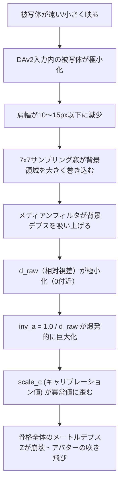

# 3D姿勢推論における距離・解像度依存の異常とアルゴリズム設計バグに関する調査報告書

## 1. 概要

現在試行中の3D姿勢推論において、「誤推論だらけになる」「被写体との距離や画像内での映る大きさに応じて極端にトラッキングが崩壊する」という課題に対し、現行パイプライン（`rtmw3d-with-depth`）の設計およびソースコードを精査しました。

その結果、**「被写体サイズ（距離）に対する解像度の非対称性（考慮漏れ）」**および**「ひねり（Yaw回転）制御における不適切なデッドゾーン閾値の設定」**という、極めて致命的なアルゴリズム設計上のバグを特定しました。本書はその詳細と具体的な改善策を報告するものです。

---

## 2. 特定した決定的なアルゴリズムバグ

### 2.1 被写体が小さく映る時のデプス解像度崩壊と背景の巻き込み（最重要）

#### 【現状の設計ギャップ】
* **2Dキーポイント検出 (RTMW3D):**
  YOLOXにより人物バウンディングボックスを検出し、その人物部分のみを拡大（クロップ）して `288x384` にリサイズして入力しています。被写体がどれだけ画面内で小さく映っていても、モデル入力時点では常に一定の高解像度で推論されます。
* **デプス推定 (Depth Anything v2):**
  人物クロップを適用せず、**全体画像（Webcam Rawフレーム）をそのまま `392x294` に縮小して入力**しています。

#### 【異常発生のメカニズム】
被写体が画面全体に対して小さく映っている（カメラから遠くにいる）場合、`392x294` ピクセルの DAv2 入力内における被写体領域は極小化します（例えば全体の高さの30%程度の場合、被写体はわずか **高さ88ピクセル × 横30ピクセル** 程度に潰れ、肩幅は **10〜15ピクセル** 程度になります）。

この極小化した被写体の肩キーポイントからデプスをサンプリングする際、**固定値 `SAMPLE_RADIUS_PX = 3` (7x7ピクセルの窓)** のメディアンフィルタを適用しています。

```rust
// src/tracking/skeleton_from_depth.rs より
pub const SAMPLE_RADIUS_PX: i32 = 3;
```

肩幅が10〜15ピクセルしかないのに対し、7x7の窓を当てると、窓の大部分が肩ではなく**「背景の壁」や「髪の毛」**を覆うことになります。
その結果、メディアンフィルタは「肩のデプス」ではなく**「背景のデプス（0.0付近）」**を代表値として吸い上げてしまいます。



これによってキャリブレーションスケール `scale_c` が異常値になり、アバターの体が前後に吹き飛ぶ、あるいは `PlausibilityRejected`（尤度判定）によってフレームのデプス情報が全て破棄されてトラッキングがフリーズ・フリッカーする現象が発生します。

---

### 2.2 両肩Z値（Yaw回転）インジェクションにおける過大なデッドゾーン（しきい値バグ）

`src/tracking/rtmw3d_with_depth.rs` において、DAv2 から得た両肩のZ軸の差（`bz_metric`）を再注入し、アバターのYaw回転（ひねり）を表現するロジックが存在します。

```rust
// src/tracking/rtmw3d_with_depth.rs より
const MIN_BZ_METRIC_M: f32 = 0.20; // デッドゾーン下限: 20cm
```

#### 【バグの内容】
* 肩幅のメートル換算想定値（`ASSUMED_SHOULDER_SPAN_M`）は **0.40m** と定義されています。
* 両肩のデプス差が 20cm 以上になるためには、$\sin\theta \ge \frac{0.20}{0.40} = 0.5$、すなわち **体が30°以上ひねられないと DAv2 からのデプス注入が作動しません（早期リターンされます）**。
* コメントには「0.15m（約22°の回転）で作動する」と書かれていますが、実際のコードの閾値が `0.20` であるため、0.15m は無視されるというコードと仕様設計の完全な矛盾が生じています。

#### 【異常発生のメカニズム】
0°〜30°のひねりに対しては DAv2 の精密なデプス情報が完全に切り捨てられ、RTMW3D の Coarse な `nz`（粗い離散値）へフォールバックします。
結果として、**体が少しひねられたときにはアバターが全く動かず、30°を超えた瞬間に急激にアバターの体が回転する不連続なジャンプ（カクつき）**が発生し、トラッキングが非常に不自然になります。

---

### 2.3 透視投影（Perspective Projection）とアフィン変換の幾何学的矛盾

#### 【設計の不整合】
現行パイプラインは、DAv2 + calibration を用いて正確なメートル単位の 3D 点群（透視投影の逆変換）を構築しているにもかかわらず、`rtmw3d_with_depth.rs` の **Phase 7** にて、**RTMW3D が出力した単純なアフィン変換座標（`nx, ny, nz` をそのままスケールしたもの）で各ジョイントの `position` を上書きしてしまっています。**

```rust
// src/tracking/rtmw3d_with_depth.rs より
for (bone, joint) in skeleton.joints.iter_mut() {
    if let Some(rtmw_joint) = rtmw_est.skeleton.joints.get(bone) {
        joint.position = rtmw_joint.position; // アフィン座標で上書き
    }
}
```

#### 【異常発生のメカニズム】
Z値だけは DAv2 由来の相対的な delta として Phase 7.5 で再注入されますが、XY座標は RTMW3D 由来のアフィンな（Z依存のない）座標のままであるため、**被写体が前後に移動した際にパースペクティブが崩壊し、関節の幾何学的一貫性が失われて手足が不自然に変形する**ことになります。

---

## 3. 解決に向けた改善ロードマップ

### 対策 A. DAv2 に対する人物クロップの適用（推奨・根本治療）

DAv2 への入力RGB画像についても、YOLOXが検出した人物バウンディングボックス（+25%パッド）でクロップした画像を入力するようパイプラインを改修します。

```
[全体カメラフレーム]
        │
        ├──> [YOLOX 人物検出] ──> [人物bbox (+25% Pad)]
        │                                 │
        │                                 ├──> [クロップ画像] ──> [DAv2 (392x294)] ──> 高解像度デプス
        │                                 │
        │                                 └──> [クロップ画像] ──> [RTMW3D (288x384)] ──> 2D関節位置
```

#### 【期待される効果】
1. 被写体がどれだけ小さく映っていても、DAv2 の `392x294` の解像度資源を「被写体そのもの」に 100% 集中させることができ、デプス解像度が劇的に向上します。
2. サンプリング窓が背景の壁を巻き込むことが無くなり、距離依存のデプス崩壊が根本解決します。
3. クロップによる焦点距離（FOV）のスケール変化を `h_half`, `v_half` に反映することで、透視投影幾何学を一貫して維持できます。

---

### 対策 B. サンプリング窓の動的スケーリング（簡易治療）

YOLOX が検出したバウンディングボックスのサイズ、または 2D 上の左右肩幅のピクセル距離に比例して、サンプリング半径 `SAMPLE_RADIUS_PX` を動的に縮小します。

#### 【期待される効果】
* 実装コストが極めて低く、被写体が小さいときは自動的に窓サイズを `1` または `0` に絞り込むことで、背景デプスのサンプリングを防ぎます。ただし、DAv2自体の解像度不足によるブレは残ります。

---

### 対策 C. Yaw回転デッドゾーン（`MIN_BZ_METRIC_M`）の最適化

* 閾値を `0.05`〜`0.08` 程度に引き下げる。
* あるいは、ハードなしきい値判定を廃止し、滑らかなソフトしきい値やブレンド（例：シグモイド重み付け）を用いて、正対付近から大角度まで滑らかに Yaw 回転が繋がるように修正します。
